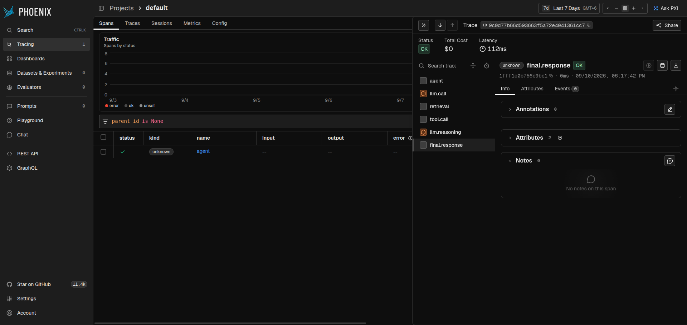
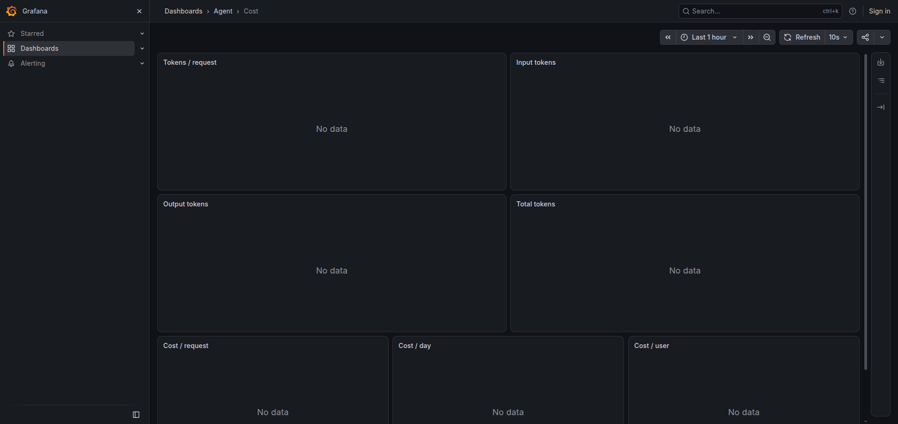
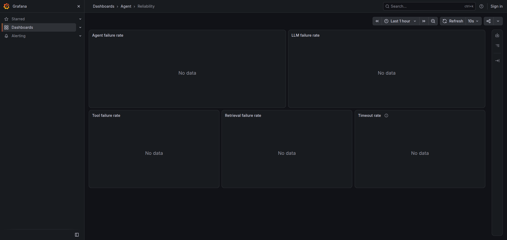
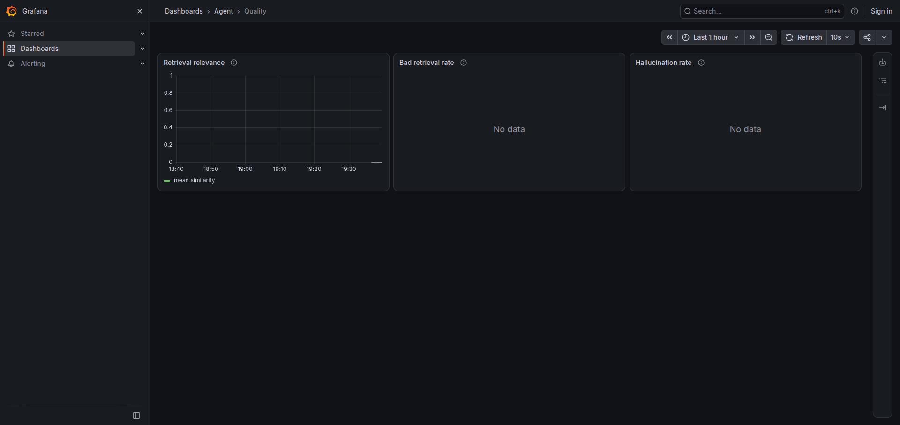

# AI Observability Assessment

A TypeScript LangGraph agent for mortgage-lending questions (base rates, products, policy), with per-request traces in Arize Phoenix and Prometheus/Grafana dashboards. Failure tests prove the observability stack is useful: slow tools, connection refused, poor retrieval, token-heavy prompts, and LLM timeouts are visible in both traces and metrics.

## 1. Problem

AI agents are difficult to debug because one user request is not one function call. It fans out into an LLM call, a retrieval, a tool, a reasoning pass, then an answer. When the reply is wrong, slow, or expensive, the failure can hide in any of those steps.

Without a shared trace id you cannot tell whether the 8-second delay was Claude, pgvector, or `getMortgageRate`. Without metrics you cannot see p95 tool latency, timeout rate, or a cost spike from an 80k-token prompt. This project instruments every step so a single request can be followed from the HTTP edge to Phoenix and Grafana.

## 2. Architecture

```
                         USER
                           │
                           ▼
                    ┌─────────────┐
                    │  TypeScript │
                    │  LangGraph  │
                    │    Agent    │
                    └──────┬──────┘
                           │
              ┌────────────┼─────────────┐
              │            │             │
              ▼            ▼             ▼
             LLM       Retrieval       Tool
              │            │             │
              └────────────┼─────────────┘
                           │
                           ▼
                    OpenTelemetry
                           │
                  ┌────────┴────────┐
                  │                 │
                  ▼                 ▼
             Phoenix            Prometheus
             (traces)               │
                  │                 ▼
                  │              Grafana
                  ▼
             Trace Explorer
```

Request path: `POST /chat { message, userId?, scenario?, requestId? }` → LangGraph (`START → agent → retrieval | tool | respond`) → OpenTelemetry spans + Prometheus metrics.

Correlation (Phase 15):

| ID | What it identifies | Where it lives |
|---|---|---|
| Request / correlation ID | One HTTP or CLI call (`req-…`) | `x-request-id`, JSON `requestId`, span attr `request.id`, logs |
| Trace ID | One OTel trace for that call | `x-trace-id`, JSON `traceId`, Phoenix |
| Span ID | One operation inside the trace | Phoenix tree: agent, llm.call, retrieval, tool.call, … |

Example: `Request ID: req-123` → `Trace ID: abc…` → Agent `span-001` → LLM `span-002` → Retrieval `span-003` → Tool `span-004`.

## 3. Technology choices

| Piece | Choice | Why |
|---|---|---|
| OpenTelemetry | Explicit `withSpan` wrappers | One portable span tree. Same exporter works for Phoenix today or Langfuse later (`OTEL_EXPORTER_OTLP_ENDPOINT`). Auto-instrumentation would hide the tree we need to demonstrate. |
| Phoenix | Self-hosted OTLP trace explorer | Pick-one rule (Langfuse is a documented endpoint swap). No extra account; Option B of the brief is AI/LLM observability. |
| Prometheus | `prom-client` at `GET /metrics` | Counters and histograms in base units, bounded labels only. Scraped every 5s. |
| Grafana | Four provisioned dashboards on :3002 | Performance, Cost, Reliability, Quality — the four questions you ask after a failure test. |
| LangGraph | Typed state graph | The agent → retrieval/tool → reasoning loop is explicit, so each node is a span seam. |
| Runtime | Bun | Spec: `Bun.serve` is not used for HTTP (Express is already the server), but `bun test` / `bun run` / auto-loaded `.env`. |
| LLM | Claude `claude-opus-5` | Single construction point in `src/llm.ts`. Do not set `temperature` / `top_p` / `top_k`. Cost: **$5 / 1M input**, **$25 / 1M output**. |
| Vector DB | PostgreSQL + pgvector | Plan requirement. Local 512-dim hash-n-gram embeddings (no extra API keys). |
| Tool | In-process `getMortgageRate` | Isolates live rates from retrieval so “connection refused” is a tool failure, not a Postgres outage. |

Chaos is opt-in (`scenario`). No scenario → the same singleton graph, 30s LLM timeout, live scores, and instant rate lookup as Phases 1–13.

## 4. Trace example

Happy-path complete flow (`bun run chat "FHA overlay and 30-year FHA rate?"`):

```
Request ID: req-7f3a…
Trace ID: abc123def456…

├── Agent
│
├── LLM Call
│   ├── Model: claude-opus-5
│   ├── Tokens: 412 in / 88 out
│   ├── Latency: 1800ms
│   └── Cost: $0.004260
│
├── Retrieval
│   ├── Query: FHA credit overlay
│   ├── Documents: product-overlays.md, …
│   └── Similarity: [0.81, 0.64, …]
│
├── Tool Call
│   ├── Name: getMortgageRate
│   ├── Arguments: {"product":"fha","termYears":30}
│   ├── Result: {"ratePercent":6.1,…}
│   └── Latency: 1ms
│
├── LLM Reasoning
│
└── Final Response
    └── FHA requires 580+ credit; the 30-year FHA rate is 6.1%.
```

Open [Phoenix](http://localhost:6006), paste the `traceId`, and read the same tree with attributes on each span (`gen_ai.*`, `retrieval.quality`, `tool.status`, `request.id`).

Failure-tree excerpts (Phase 14):

```
├── Tool Call
│   └── 8.2 sec ⚠️          ← slow_tool

├── Tool Call
│   ├── Status: ERROR
│   └── Error: Connection refused   ← tool_failure

├── Retrieval
│   ├── Similarity: [0.31,0.28,0.24]
│   └── Quality: Poor               ← bad_retrieval

├── LLM Call
│   ├── Tokens: 80000+ in
│   └── Cost: $0.40…                ← token_heavy

├── LLM Call
│   ├── Status: ERROR
│   ├── Error: Request timeout
│   └── Latency: (prod timeout 30s; chaos aborts immediately)  ← llm_timeout
```

## 5. Metrics

Leave `bun run dev` running so Prometheus can scrape `GET /metrics`. Grafana is anonymous at [http://localhost:3002](http://localhost:3002) (admin/admin).

| Dashboard | URL | What a failure test moves |
|---|---|---|
| Performance | [agent-performance](http://localhost:3002/d/agent-performance) | `slow_tool` → **Tool p95** up |
| Cost | [agent-cost](http://localhost:3002/d/agent-cost) | `token_heavy` → input tokens and $ / request |
| Reliability | [agent-reliability](http://localhost:3002/d/agent-reliability) | `tool_failure` → tool error rate; `llm_timeout` → timeout rate |
| Quality | [agent-quality](http://localhost:3002/d/agent-quality) | `bad_retrieval` → mean similarity down, bad-retrieval rate up |

Hallucination rate on Quality is **evaluation-derived** (LLM-as-judge groundedness), not a heuristic. Judge tokens are not counted in `llm_*`.










Panels stay empty until `bun run dev` is up and `/chat` (or `bun run demo`) generates traffic Prometheus can scrape. After the five failure demos, Performance’s tool p95, Cost’s token rate, Reliability’s error/timeout rates, and Quality’s bad-retrieval rate all move.

## 6. Failure scenarios

Run from `backend/` with compose up (Postgres + Phoenix + Prometheus + Grafana) and `bun run ingest` done. Production LLM timeout is **30s**; chaos uses a 1ms client timeout so the demo is reproducible.

```bash
bun run demo slow_tool      # ~8s tool span; Grafana tool p95 ↑
bun run demo tool_failure   # Tool ERROR / Connection refused; request still answers
bun run demo bad_retrieval  # scores 0.31 / 0.28 / 0.24; Quality: Poor
bun run demo token_heavy    # ~80k input tokens; ~$0.40 at Opus 5 rates
bun run demo llm_timeout    # LLM ERROR / Request timeout; HTTP 500 with ids
```

Same faults from HTTP or the UI ([Failure test](docs/screenshots/frontend-chat.png) dropdown):

```bash
curl -s http://localhost:3000/chat \
  -H 'Content-Type: application/json' \
  -H 'x-request-id: req-demo-1' \
  -d '{"message":"What is the current 30-year FHA mortgage rate?","scenario":"slow_tool","userId":"demo"}'
```

| Scenario | Injected at | Trace | Grafana |
|---|---|---|---|
| `slow_tool` | `getMortgageRate` lookup | Tool ~8.2s ⚠️ | Performance / tool p95 |
| `tool_failure` | same lookup throws | Tool ERROR, Connection refused | Reliability / tool errors |
| `bad_retrieval` | `similaritySearch` scores | Quality: Poor | Quality / bad retrieval rate |
| `token_heavy` | agent system-prompt pad | 80k+ input tokens, cost | Cost / tokens |
| `llm_timeout` | per-request 1ms LLM client | LLM ERROR, Request timeout | Reliability / timeout rate |

`token_heavy` is the only scenario that spends real tokens at that scale. Automated tests stub `usage_metadata` and never pad 80k tokens.

## 7. Results

Observability turned five “the agent is broken” reports into five different diagnoses:

1. **Slow tool** — the LLM spans were normal; the tool span was 8 seconds. p95 tool latency on Performance confirmed it was not a model regression.
2. **Tool failure** — `Connection refused` stayed on the tool span with ERROR status. The request still completed because tool errors are data (`ToolMessage`); the model reported it could not quote a rate instead of inventing 6.1%.
3. **Bad retrieval** — similarity 0.31 / 0.28 / 0.24 is below the 0.35 threshold. Quality went Poor *before* the answer went off-policy. The Quality dashboard’s bad-retrieval rate moved; groundedness judge is the second line of defense.
4. **Token-heavy prompt** — input tokens jumped to 80k+ and cost followed. Cost-by-user (`userId`) shows which caller paid.
5. **LLM timeout** — the only request-failing failure. The LLM span is ERROR / Request timeout; `llm_timeouts_total` increments; `x-request-id` and `x-trace-id` are still returned on the 500 so you can open the same trace in Phoenix.

Correlation ids are what make that last step possible: one `req-…` in the log line, the same id on every span, the same hex `traceId` in Phoenix.

## Prerequisites

- [Bun](https://bun.sh) v1.3+
- An [Anthropic API key](https://console.anthropic.com/) for live chat (tests without the key still run against a fake model)
- Docker (Postgres + pgvector, Phoenix, Prometheus, Grafana)

## Setup

```bash
cd backend
bun install
cp .env.example .env
# set ANTHROPIC_API_KEY

docker compose -f ops/docker-compose.yml up -d
bun run ingest
```

Phoenix is required for the trace demo (:6006). Prometheus (:9090) scrapes the **HTTP server** at `GET /metrics` — keep `bun run dev` running so Grafana fills. Grafana is on **:3002** (the Next.js frontend keeps :3001). To run the agent with compose down, set `OTEL_SDK_DISABLED=true`.

## Run

From `backend/`:

```bash
bun run dev                                          # HTTP :3000
bun run chat "What is the current base rate?"
bun run chat -- --user alice --scenario slow_tool "30-year FHA rate?"
bun run demo tool_failure
bun test                                             # fake-model suite; live tests skip without keys
```

### Web UI (`frontend/`)

Next.js chat on **http://localhost:3001** — pipeline + capture panels + optional Failure test dropdown. Proxies to the backend via `/api/chat`.

```bash
cd frontend
npm install
cp .env.example .env.local
npm run dev   # :3001 → backend :3000
```

### HTTP API

**`GET /health`** `{ "ok": true }`

**`GET /metrics`** Prometheus text (scraped every 5s). The one-shot CLI does not keep a scrape target alive.

**`POST /chat`**

Optional `userId` (bounded `[a-zA-Z0-9_-]{1,32}`) labels Cost/user. Optional `scenario` (see §6). Optional `requestId` or inbound `x-request-id`.

```bash
curl -sD - http://localhost:3000/chat \
  -H 'Content-Type: application/json' \
  -d '{"message":"What is the current base rate?","userId":"demo"}'
```

Success JSON includes `reply`, `flow`, `requestId`, `traceId`, capture arrays, `durationMs`. Responses (including 500) set `x-request-id` and `x-trace-id`.

## Project layout

```
ai-assessment/
├── README.md
├── CONTEXT.md
├── docs/adr/
├── docs/screenshots/
├── frontend/                 # Next.js UI (:3001)
└── backend/
    ├── SPEC.md               # 18-phase tracker
    ├── AGENT.md
    ├── ops/                  # compose, prometheus, grafana
    ├── rag/docs/
    ├── src/
    │   ├── chaos.ts          # P14 fault injection (opt-in)
    │   ├── demo.ts           # bun run demo <scenario>
    │   ├── llm.ts
    │   ├── server.ts         # POST /chat, GET /health, GET /metrics
    │   ├── chat.ts
    │   ├── rag/
    │   ├── tools/
    │   ├── obs/              # includes requestContext.ts (P15)
    │   └── agent/
    └── tests/                # agent, retrieval, tool, timeout, observability, …
```

## Docs

- [`backend/SPEC.md`](backend/SPEC.md) — 18-phase tracker, decisions, and gates
- [`backend/AGENT.md`](backend/AGENT.md) — conventions for anyone changing this repo
- [`backend/.env.example`](backend/.env.example) — environment variables
- [`docs/adr/0001-in-process-rate-table.md`](docs/adr/0001-in-process-rate-table.md) — why chaos is a function seam
- [`docs/adr/0002-explicit-withspan-otel.md`](docs/adr/0002-explicit-withspan-otel.md) — why explicit spans
